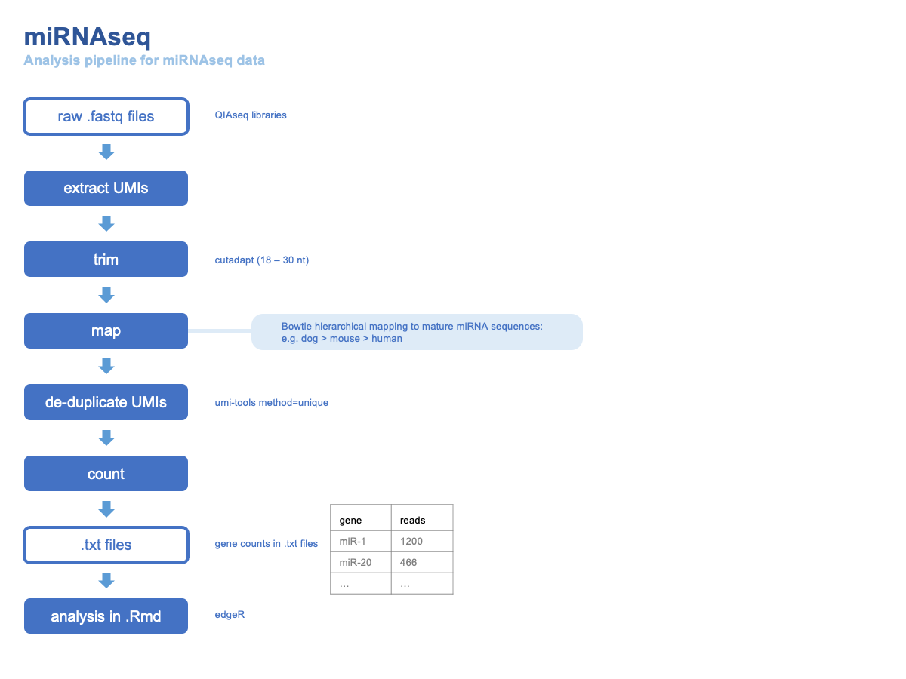

# README - miRNAseq

## Overview

This miRNA mapping and analysis pipeline is based on ones used by [Potla et al.](https://www.sciencedirect.com/science/article/pii/S266591312030131X) and by [Edinburgh Genomics](https://genomics.ed.ac.uk/).  Differential expression analysis is performed using [edgeR](https://www.bioconductor.org/packages/release/bioc/vignettes/edgeR/inst/doc/edgeRUsersGuide.pdf).  

## Workflow

### Libraries 

Starting material: libraries prepared using QIAseq miRNA library kit.  This involves chemical enrichment for miRNAs, application of a UMI (unique molecular identifier = random barcode) during RT step, PCR amplification then size-selection.  UMI = 12 nt for QIAseq kit.  Structure of reads shown in [QIAgen manual](https://resources.qiagenbioinformatics.com/manuals/biomedicalgenomicsanalysis/current/index.php?manual=Create_UMI_Reads_miRNA.html); the 19nt common sequence is the 3' adapter: AACTGTAGGCACCATCAAT.  

### Pipeline

Main steps: raw raeds (fastq) > QC (multiQC) > UMI extraction (umi tools) > trimming (cutadapt) > mapping (bowtie) > UMI deduplication > count > downstream analysis

Map to mature miRNA sequences from miRBase.  (NB Need to first convert Us to Ts in .fa files.)

## UMI handling

Basic [workflow](https://umi-tools.readthedocs.io/en/latest/QUICK_START.html): 

1) extract UMI from raw reads (`umi_tools extract`)   
2) trim / filter (e.g. `cutadapt`)  
3) map (then convert to .bam, sort and index)    
4) deduplicate (`umi_tools dedup`: groups PCR duplicates and deduplicates reads to give one read per group)  
5) count (`samtools index` >`samtools idxstats`)  

The default method is [directional network-based deduplication](https://umi-tools.readthedocs.io/en/latest/the_methods.html) - which takes into account an PCR errors that may have been introduced into the UMI itself.  Particularly for long UMIs, this is [superior](https://cgatoxford.wordpress.com/2015/08/14/unique-molecular-identifiers-the-problem-the-solution-and-the-proof/) to alternative methods (e.g. simply counting unique UMIs).  However, the memory usage is excessive and for many applications precludes this running; so use unique method for expediency.  

For counting, after mapping to miRNA.fa, standard methods used when aligning to whole genome (`FeatureCounts`, `HTSeq`) won't work.  Instead use `samtools idxstats`; in output, col1 = name, col3 = read count.  

